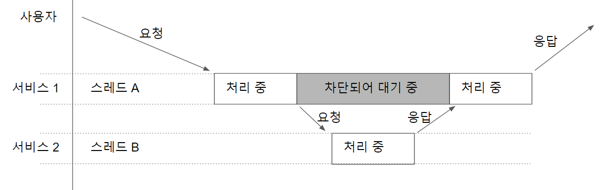
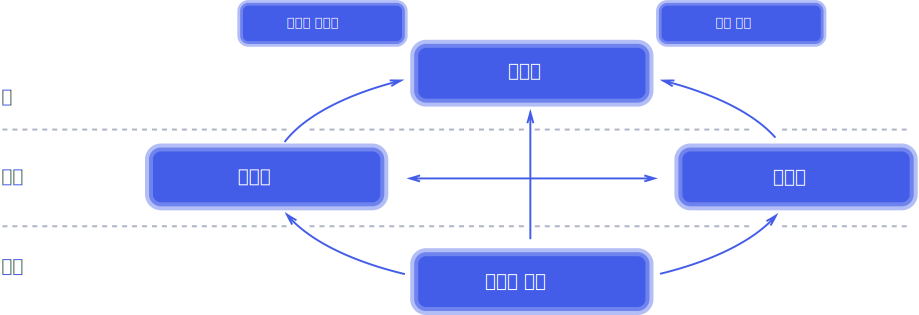

# webflux

* H2 Console 접근 URL `http://localhost:8082`

* 리액티브 정의 개념 [링크](https://www.reactivemanifesto.org/ko/glossary)

## 왜 리액티브인가

* 기존 블로킹 처리 방식

    * 스레드 B 의 작업이 끝날 때까지는 스레드 A 다른 작업을 처리할 수 없다.
    
* 자원을 효율적으로 사용할 수 없음
* 아마존이나 월마트 등 기업에서 증가한 부하에 대해 처리를 하지 못하고 장애가 일어난 일도 있음
* 위와 같은 문제를 해결하기 위해 리액티브가 필요로 함

## 리액티브 선언문 [링크](https://www.reactivemanifesto.org/ko)

* 가치
    * 응답성: 시스템이 가능한 즉각적으로 응답하는 것
* 매개체
    * 탄력성: 많고 적든 다양한 작업 부하에서 응답성을 유지하는 것
    * 복원력: 시스템 장애 발생 시에도 응답을 유지하는 것
* 표현 방식
    * 메시지 기반: 비동기 메시지 전달에 의존하여 구성 요소 간의 느슨한 결합

## 스프링을 이용한 리액티브 프로그래밍

### 초기 해결법

* 옵저버 패턴
* @EventListener를 사용한 발행 구독 패턴

위와 같은 해결 방법은 있지만 스레드 풀을 사용해서 처리를 하는데 리액티브 프로그래밍에서는 스레드 풀을 사용하지 않음

또 구독자의 수와 관계없이 하나의 이벤트 스트림을 생성하는데 구독자가 없을 때도 생성한다. -> 하드웨어 수명 단축

### 리액티브 라이브러리 RxJava

* Rx 는 MS 내부에서 대규모 비동기 및 데이터 집약적 인터넷 서비스 아키텍쳐에 적합한 프로그래밍 모델을 실험해서 2007년에 탄생함

* 후에 Rx.NET 시작으로 Javascript, C++, Ruby, Object-C 의 언어에서도 사용할 수 있는 라이브러리를 제공하게됨

* 넷플릭스의 벤 크리스텐슨은 Rx.NET 을 자바 플랫폼으로 이식하고 RxJava 라이브러리 오픈 소스 공개함

* 넷플릭스에서 엄청난 양의 인터넷 트래픽을 처리해야하는 문제가 있었는데 RxJava 로 처리하게 됨
