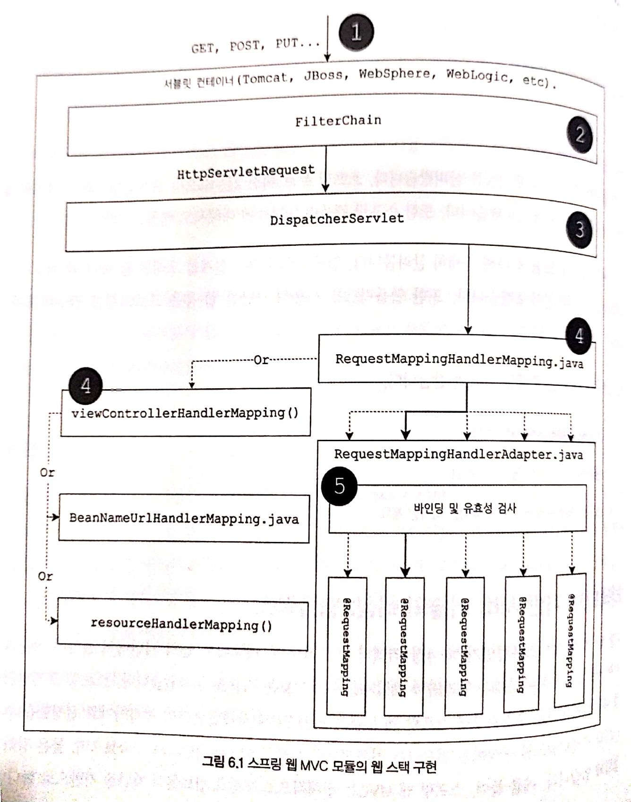
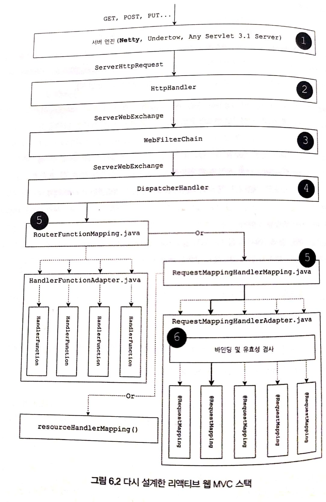

# 비동기 논블로킹 통신

## 스프링 웹 MVC 모듈 웹 스택

* 전체적으로 Servlet 에 의존이 되어있다.



## 리액티브 웹 MVC 스택

* 서버 엔진을 netty 로 두고 있다. 



## 라우팅 작성 방법

```java
@Bean
public RouterFunction<ServerResponse> routes(
    OrderHandler handler){
    return nest(path("/orders"),
             nest(accept(APPLICATION_JSON),
                route(GET("/{id}", handler::get), handler::list)
             )
             .andNest(contentType(APPLICATION_JSON),
                route(POST("/"), handler::create)
             )
           );
}
```

